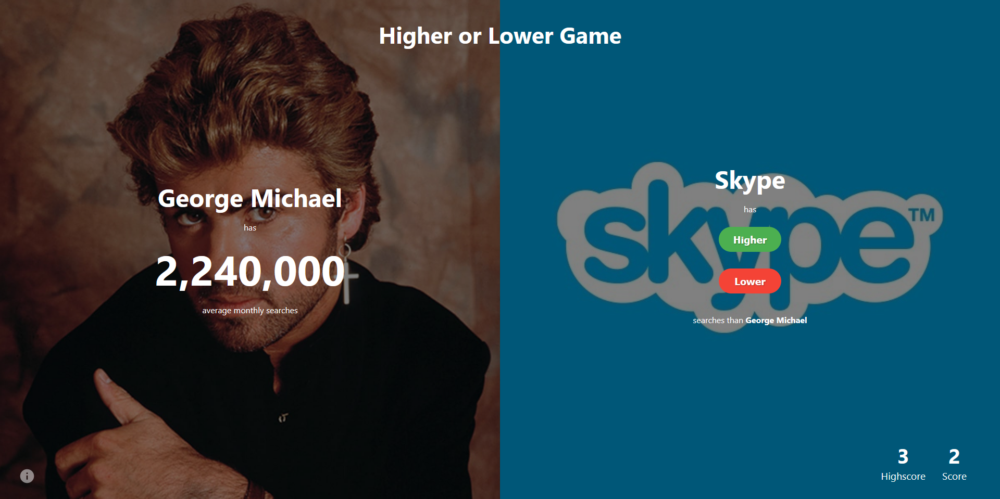

# Higher Lower Game
Welcome to the "Higher Lower Game"! This game was inspired by [The Higher Lower Game](http://www.higherlowergame.com/).

## Tech Stacks
  - [HTML5](https://developer.mozilla.org/en-US/docs/Glossary/HTML5) - [🛠️](https://stackshare.io/html5) - [🐙](https://github.com/topics/html5) - HTML5 is a markup language used for structuring and presenting content on the World Wide Web.
  - [CSS3](https://developer.mozilla.org/en-US/docs/Web/CSS) - [🛠️](https://stackshare.io/css-3) - [🐙](https://github.com/topics/css) - Cascading Style Sheets (CSS) is a stylesheet language used to describe the presentation of a document written in HTML.  
  - [React](https://reactjs.org/) - [🛠️](https://stackshare.io/react) - [🐙](https://github.com/facebook/react) - React components can be used on the client and server side.
  - [Netlify](https://netlify.com/) - [🛠️](https://stackshare.io/netlify) - [🐙](https://github.com/netlify) - Netlify is a global CDN that makes continuous deployments as simple as a few clicks. 
  - [Vite](https://vitejs.dev/) - [🛠️](https://stackshare.io/vite) - [🐙](https://github.com/vitejs/vite) -  It is an opinionated web dev build tool that serves your code via native ES Module imports during dev and bundles it with Rollup for production.
